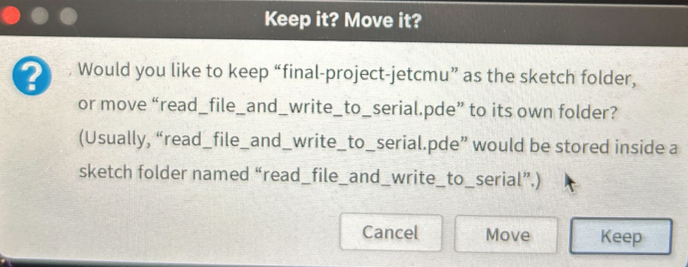

# Hints

## For C0

* Use newlines, instead of csv directly (and [`read_lines`](./lib/readline.c0) from previous homeworks)

  Example conversion: `curl 'https://api.open-elevation.com/api/v1/lookup?locations=10,10' | dasel -r json -w csv 'results' | tr ',' '\n' > newline.txt`.
  Example code:

  ```c
    #use <conio>
    #use <string>
    #use <parse>

    int main() {
      bundle_t S = read_lines("newline.txt");
      int length = string_bundle_length(S);
      string[] data = string_bundle_array(S);

      println("Before:");
      for (int i = 0; i < length; i++) {
        printf("%s\n", data[i]);
      }
      println("--------------------");


      return 0;
  }
  ```

* You're probably using floats. C0 does not like floats. You can work with everything as strings, or write functionality to drop floating numbers:

  ```c
  char[] drop_float(char[] A, char[] B, int len) {
  for (int i = 0; i < len; i++) {
    char c = A[i];
    if (c == '.') {
      return B;
    } else {
      B[i] = A[i];
    }
  }
  return B;
  ```

  Then, you may parse it from `string` to `int` like this:

  ```c
  #use <conio>
  #use <string>
  #use <parse>

  int main() {
    bundle_t S = read_lines("newline.txt");
    int length = string_bundle_length(S);
    string[] data = string_bundle_array(S);

    int len = string_length(data[3]);
    char[] A = string_to_chararray(data[3]);
    char[] B = alloc_array(char, len);
    char[] C = drop_float(A, B, len); // comes in as 515.000000, given the data above
    int* num = parse_int(string_from_chararray(C), 10);
    printf("%d\n", *num); // prints 515, given the data above
  return 0;
  }
  ```
  
## Make the Processing sketch folder your finalproject repo

In order to be able to have a shell script that updates the `commands.txt` file every time you loop through
the script or make changes, do make sure your `Processing` sketch repo points to your finalproject folder. 
If you get a prompt like this from Jet's session (Thanks Jet!), 
then `keep` it:



And, if you go to `Sketch` -> `Show Sketch Folder`, it should open-up your finalproject repo folder. You should see a `sketch.properties` file in your folder, which is fine to push up on GitHub!

Here's a short video of me updating the `commands.txt` file via a shell script:

[video](./vid.mov "Example Video")

## Help

Finally, if you any issues, please reach out to us!